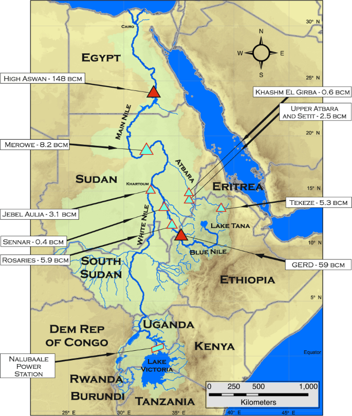
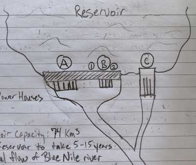
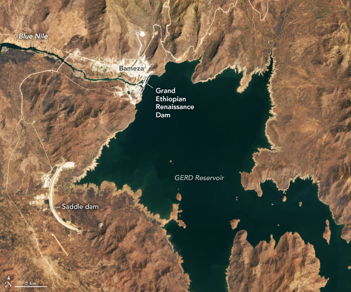

# The Grand Ethiopian Renaissance Dam Background

Ethiopia has built a massive dam on the Blue Nile River (a tributary of the Nile River) called the Grand Ethiopian Renaissance Dam (GERD). This dam will provide water and power for the people of Ethiopia, but there is concern by Egypt (whom is down river of the Nile) that this dam will greatly affect the amount of water they receive from the Nile. There are many estimates of how long it would take to fill the reservoir, anywhere between 2 to 40 years, each with a big impact to the goals of Ethiopia and Egypt.

  
*Dam image from Feb. 10, 2022, AL-Monitor (1)*

## Dam Location and Metadata

The GERD is located in northeastern Ethiopia near the boarder with Sudan on the Blue Nile River.

  
*Map of the Nile Basin with major infrastructre, nature.com (2)*

The GERD is 155 meters tall above the ground (with an additional 15 meters below ground level).

  
*Specs of the GERD, Frazier (3)*

The dam has three spillways.  The main floodgates (A) are gated and located at 124.9 meters above ground.  An ungated spillway (B) is at 140 meters above ground and is also the full supply level of the dam.  A third emergency spillway (C) is at the top of the dam at 155 meters above ground and is the crest of the dam.

  
*Spillways of the GERD, Frazier (4)*

## Reservoir

  
*Image of the GERD Reservoir from Feb. 14, 2022, earthobservatory.nasa.gov (6)*

## What are Hydroelectric Dams?

A hydroelectric dam is a large, man-made structure built to contain some body of water.  The purpose of a hydroelectric dam is to provide a place to convert the potential and kinetic energy of water to electrical energy by using a turbine and generator.  Dams act as the place where water is held back and released in a controlled manner down to these turbines, providing the location for the energy transformations to occur.  Typical dams work to create a reservoir where water is stored at a given height.  This height and the speed at which the water falls from the reservoir to the turbines determines how much electricity can be generated. (5)

  
*Diagram of the main components of a convential hydroelectric facility, energyeducation.ca (5)*

### Reservoir

A hydroelectric reservoir is a collection of water held back by a hydroelectric dam. This water has a set amount of potential energy as it is held above the tail race of the dam, and the potential energy is used for generating electricity. The height that the water in the reservoir is at is known as the hydraulic head, and is one of the major factors in determining how much electricity can be generated. The higher the water is, the more potential energy it has and thus the more electricity can be generated. (5)

### Penstock

Penstocks are pipes or long channels that carry water down from the hydroelectric reservoir to the turbines inside the actual power station.  Generally, they are made of steel and water under high pressure flows through the penstock. They are a vital component of a hydroelectric facility that allows water to move to the turbine. Grates or filters can be attached to the ends of penstocks to trap large debris such as branches. This ensures that debris cannot enter the channel and block it.  The amount of water that is allowed to flow through the penstock can be controlled with a sluice, which is simply a gate that can be raised and lowered to increase or decrease the amount of water allowed to flow through. (5)

### Turbines

Hydro turbines are devices used in hydroelectric generation plants that transfer the energy from moving water to a rotating shaft to generate electricity. These turbines rotate or spin as a response to water being introduced to their blades. The type of turbine selected for any given hydropower project is based on the height of the water storage - known as the hydraulic head - and the volume of water that flows known as the flow rate. Efficiency and cost are also factors to be considered. (5)

## Elevation and Flow of the Nile River Tributaries

  
  

## TBD
  
  
  

## Sources
1. https://www.al-monitor.com/originals/2022/07/negotiations-falter-ethiopia-begins-third-stage-filling-nile-dam
2. https://www.nature.com/articles/s41467-020-19089-x
3. Chart of the GERD specs, Chris Frazier
4. Spillways of the GERD, Chris Frazier
5. https://energyeducation.ca/encyclopedia/Hydroelectric_facility
6. https://earthobservatory.nasa.gov/images/149691/a-grand-new-dam-on-the-nile