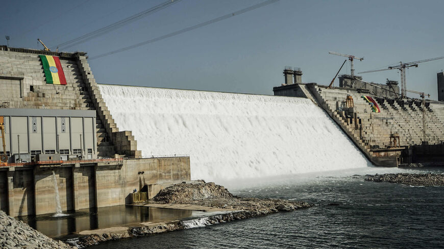
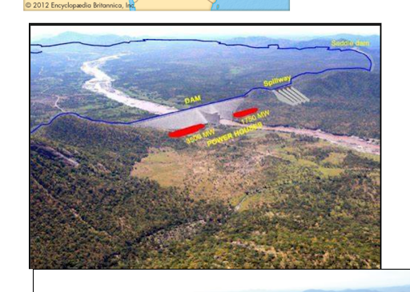
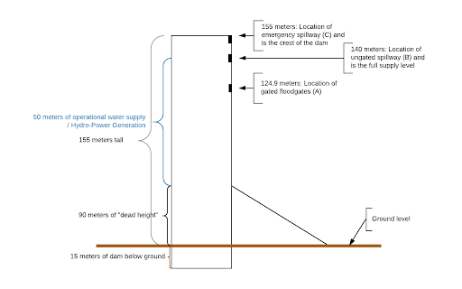
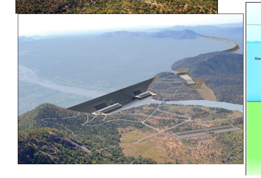
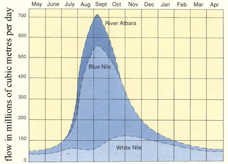
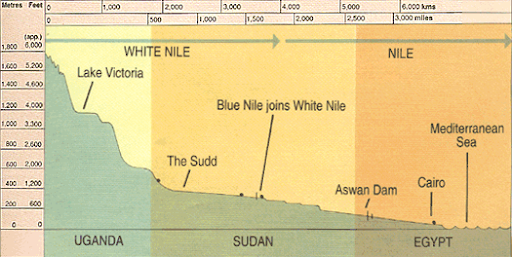
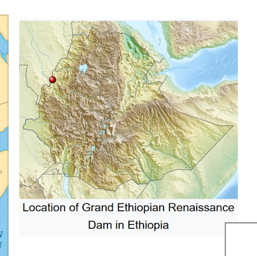
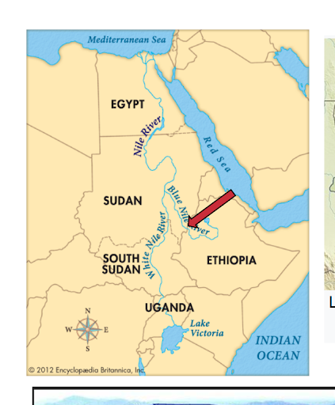
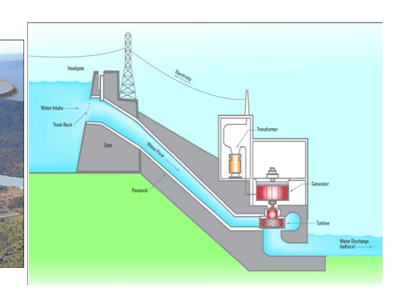
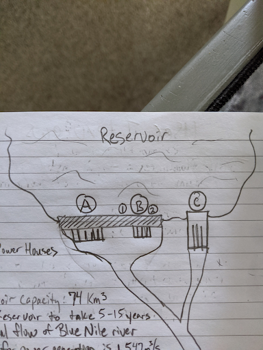

# The Grand Ethiopian Renaissance Dam Background

Ethiopia has built a massive dam on the Blue Nile River (a tributary of the Nile River) called the Grand Ethiopian Renaissance Dam. This dam will provide water and power for the people of Ethiopia, but there is concern by Egypt (whom is down river of the Nile) that this dam will greatly affect the amount of water they receive from the Nile. There are many estimates of how long it would take to fill the reservoir, anywhere between 2 to 40 years, each with a big impact to the goals of Ethiopia and Egypt.

Dam image from Feb. 10, 2022, AL-Monitor (1)

## Dam Location

## What are Hydroelectric Dams?

## Sources
1. https://www.al-monitor.com/originals/2022/07/negotiations-falter-ethiopia-begins-third-stage-filling-nile-dam
2. https://www.nature.com/articles/s41467-020-19089-x